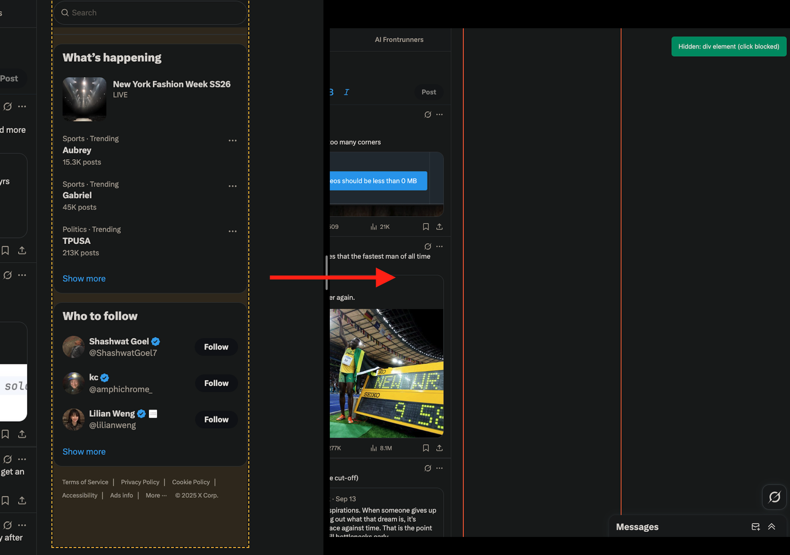

# Oblivion

# Note: I paused development on this because of bandwith. There's a ton of validation for this and someone should definitely pick it up.

There is a feature in the Arc browser someone told me about called "Arc Boosts". 

https://resources.arc.net/hc/en-us/articles/19212718608151-Boosts-Customize-Any-Website

It does the exact same thing without the proactive AI, and people love it:
- https://x.com/Stammy/status/1562311240826888192
- https://x.com/nateparrott/status/1661737457187196930

Useful link: https://www.reddit.com/r/ArcBrowser/comments/18wi7g0/how_do_you_use_boost_in_arc_browser/

and some other use cases boost contains: https://x.com/bantg/status/1699364366678687855

A lot of value to deliver here. Let me know if you want to pick it up. 
Instructions.md contains all the updates this needs to be robust. The element selectors I use in "initial implementation" are garbage, in fact most of it is currently garbage (except the point-and-click removal, did some tiny work on that). There are robust libraries and ways to do all of the individual functionalities. 

All the starting instructions are within oblivion/instructions.md. Reach out to me if you do, @mayonkeyy on twitter.

---

**Oblivion** is a unified, minimal, Manifest V3 Chrome extension that combines natural-language, AI-driven element detection with a manual click-to-select element remover. It’s built to be safe, reversible, and developer-friendly — hide annoying page elements (ads, popups, widgets) with a prompt or pick them manually.

---

# Project overview

Element Remover Pro merges two workflows into one ergonomic extension:

* **AI Mode** — use natural language (e.g., `hide ads and sidebars`) to let an LLM generate targeted CSS selectors and preview matches.
* **Manual Mode** — hover + click to visually select elements; manual mode stays active so you can remove multiple items without re-entering the mode.

Design goals: minimal permissions, non-destructive operation (hide vs remove), strong undo/reset semantics, and a reliable AI-first → pattern-fallback pipeline.

# Installation (developer / local)

1. Open `chrome://extensions/`.
2. Turn on **Developer mode**.
3. Click **Load unpacked** and select the repo directory.
4. Click the extension icon → Settings → paste your OpenAI API key (optional).
5. Choose model (GPT-4o-mini recommended) and test API key.

*No build step — this repo is vanilla JS; files are loaded directly by Chrome.*

---

# Quick usage

**AI mode**

1. Click extension icon → choose **AI Mode**.
2. Enter a prompt like `hide ads and sidebars` or `hide newsletter signups`.
3. Preview highlights will appear; click overlays to toggle selection.
4. Click **Apply** to hide selected elements (non-destructive).
5. Use **Reset Page** ↔ **Restore Changes** to toggle state.

**Manual mode**

1. Click **Start Selection** (green indicator).
2. Hover to highlight; click to hide an element.
3. Manual mode stays active until you press `ESC`.
4. Undo restores the last hide action.

---

# Key internal patterns & flow

* **AI-first pattern**: try LLM → if error & `enableFallback` true, use pattern matchers.
* **Persistent manual mode** — click to hide element but keep click mode active.
* **Preview overlays** — clickable overlays that toggle a pending selection. Visual states: `selected` (full color) vs `unselected` (dimmed).
* **Toggle Reset** — first click restores page (saves history), second click re-applies saved history.
* **Safety checks** — element visible (width/height > 0), count limit (max 100), overlay exclusion (don’t remove UI overlays).

---

# Safety & design choices

* **Non-destructive edits**: we set `style.display='none'` instead of removing DOM nodes.
* **Max element cap**: prevents catastrophic removals (default: 100 elements).
* **Preview before apply**: AI mode always shows a preview overlay list; user must explicitly apply changes.
* **Rate limit for AI**: 20 seconds cooldown to avoid abuse or request storms.
* **No credentials baked in**: API key stored locally via `chrome.storage` by the user.

---

# Testing checklist

**AI Mode tests** (requires API key)

* `hide ads and banners` — AI suggests selectors for ad blocks; preview shows expected targets.
* `remove social media widgets` — targets share buttons and embeds.
* `hide popup overlays` — targets modal overlays without touching main content.

**Manual Mode tests**

* Enter manual mode — green banner visible; `ESC` exits.
* Hover highlights element; clicking hides element and remains in manual mode.
* Undo restores last removal; history preserves across popup close/reopen.

**Reset toggle**

* Remove elements → press **Reset Page** → page restored; button becomes **Restore Changes**.
* Press **Restore Changes** → removals re-applied.

